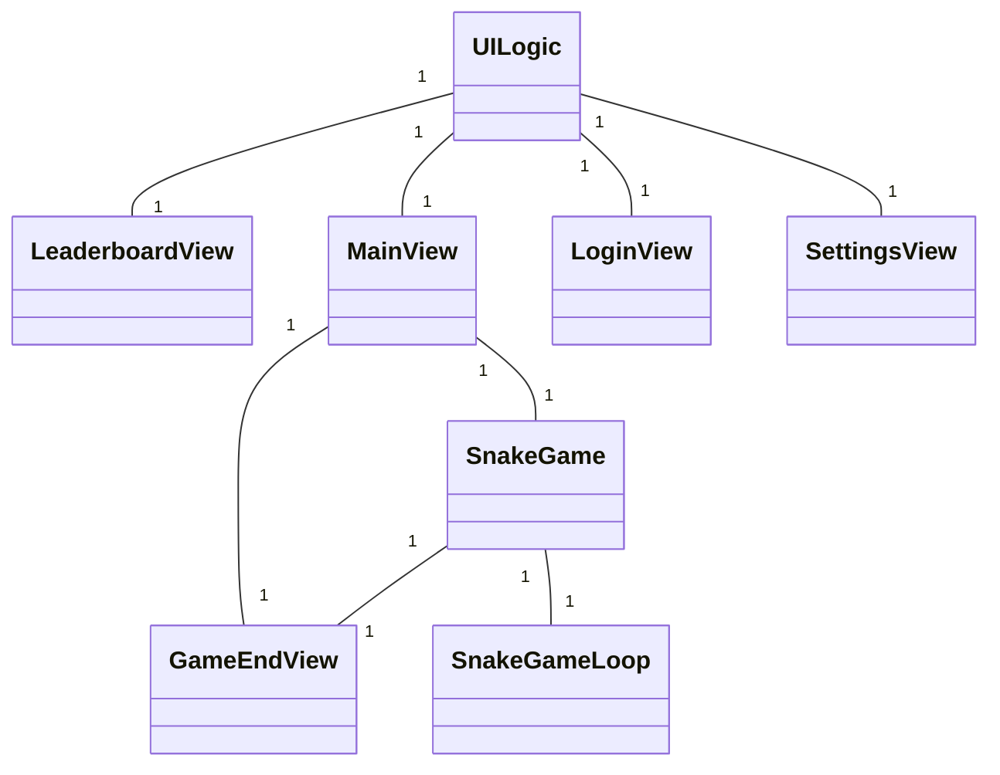
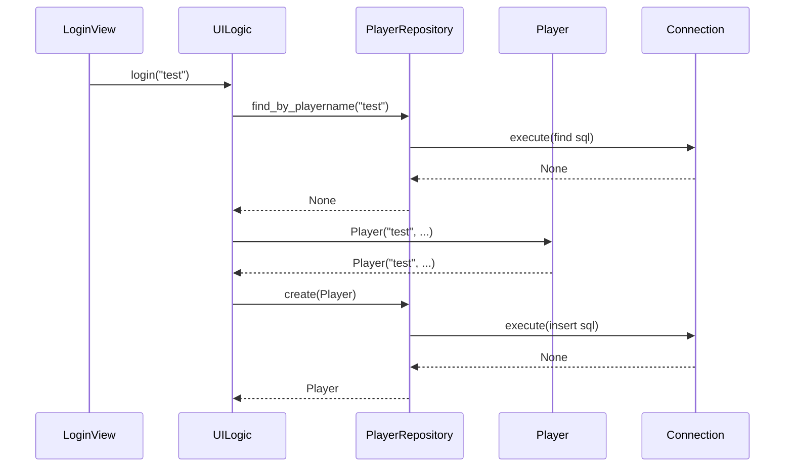
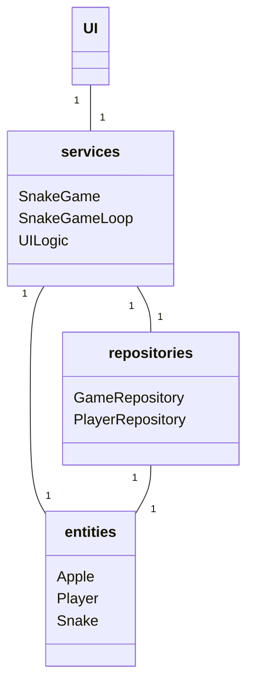

## Luokkakaavio

## Sekvenssikaavio kirjautumisesta
Oletuksena on, että tietokanta on tyhjä.

## Sovelluslogiikka
Sovelluslogiikka on jaettu kahteen osaan. Käyttöliittymään ja peliin.
`UILogic` luokka vastaa käyttöliittymän logiikasta, ja `SnakeGame` luokka pelin logiikasta.  

Käynnistyksen yhteydessä luotu `UILogic` objekti annetaan parametrina aina `UI` luokille, joiden pitää
käyttää esimerkiksi tietokantaa. `UILogic` objektiin tallenetaan myös kirjautumisen yhteydessä
nykyinen `Player` -olio.  

`SnakeGame` luokalle annetaan `start` metodia kutsuttaessa pelinpäättymis metodi parametrina, jonka perusteella
`SnakeGame` avaa pelinpäättymisnäkymän.  

`UILogic` pääsee käsiksi `PlayerRepository` sekä `GameRepository` luokkiin, sillä sen toimivuus vaatii
kummankin käyttöoikeutta. `SnakeGame` pääsee käsiksi `GameRepository`, jotta se pystyy tallentamaan pelejä tietokantaan.

## Pakkauskaavio
