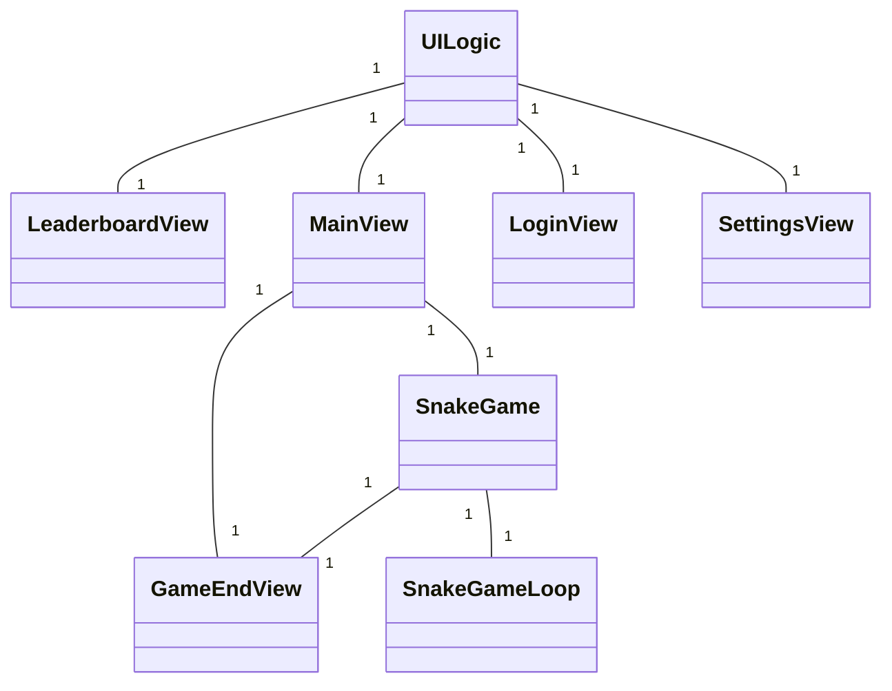
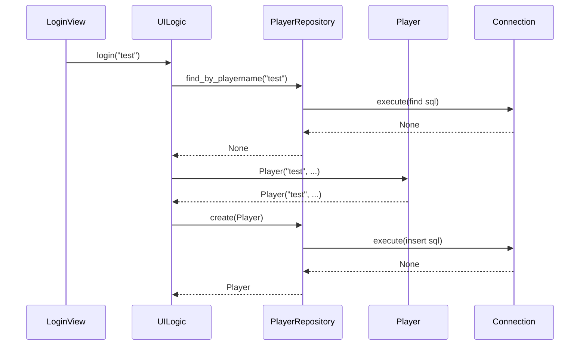

## Luokkakaavio

```mermaid
classDiagram
    UILogic "1" -- "1" LeaderboardView
    UILogic "1" -- "1" MainView
    UILogic "1" -- "1" LoginView
    UILogic "1" -- "1" SettingsView
    MainView "1" -- "1" SnakeGame
    SnakeGame "1" -- "1" GameEndView
    GameEndView "1" -- "1" MainView
    SnakeGame "1" -- "1" SnakeGameLoop
```

## Sekvenssikaavio kirjautumisesta
Oletuksena on, että tietokanta on tyhjä.

```mermaid
sequenceDiagram
	participant LoginView
	participant UILogic
	participant PlayerRepository
	participant Player
	participant Connection
	LoginView ->> UILogic: login("test")
	UILogic ->> PlayerRepository: find_by_playername("test")
	PlayerRepository ->> Connection: execute(find sql)
	Connection -->> PlayerRepository: None
	PlayerRepository -->> UILogic: None
	UILogic ->> Player: Player("test", ...)
	Player -->> UILogic: Player("test", ...)
	UILogic ->> PlayerRepository: create(Player)
	PlayerRepository ->> Connection: execute(insert sql)
	Connection -->> PlayerRepository: None
	PlayerRepository -->> UILogic: Player
```