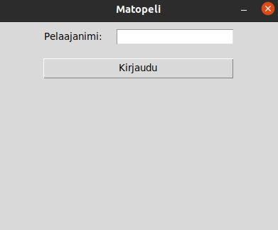
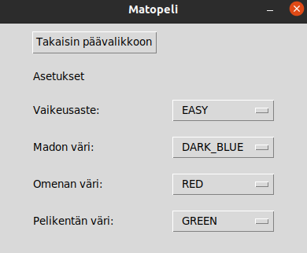

## Käyttöohje
Lataa viimeisin versio [täältä](https://github.com/DeeCaaD/ohte/releases/latest/).

### Konfigurointi
Pelin tietokannan tiedostopolkua voi konfiguroida `harjoitustyo/.env` tiedostossa.  
Oletuksena polku on `database.sqlite`, eli tietokanta luodaan sovelluksen 
käynnistyksen yhteydessä polkuun `harjoitustyo/src/database.sqlite`.

### Ohjelman käynnistäminen
1. Siirry terminaalissa kansioon ``harjoitustyo/``
2. Asenna riippuvuudet ``poetry install``
3. Käynnistä sovellus ``poetry run invoke start``

### Kirjautuminen
Peli käynnistyy ensiksi kirjautumisnäkymässä:  

Kirjautuminen tapahtuu antamalla 4-20 merkkinen pelaajanimi.
Jos annettua pelaajanimeä ei ole aiemmin käytetty, niin se luodaan automaattisesti tietokantaan.

### Asetusten muokkaaminen
Asetuksiin pääsee pääkäyttöliittymästä. Asetuksetnäkymä:  

Asetuksia voi muokata klikkaamalla pudostusvalikkoa, 
ja vaihtamalla mieleisen värin tai vaikeusasteen siitä.
Asetukset tallennetaan, kun takaisin päävalikkoon -painiketta painetaan.

### Peli
Matopelin pelaaminen tapahtuu nuolinäppäimillä. Pelissä saa pisteitä syömällä omenoita.
Madon syödessä omenan sen koko kasvaa. Madon osuessa pelikentän reunaan tai itseensä peli loppuu.