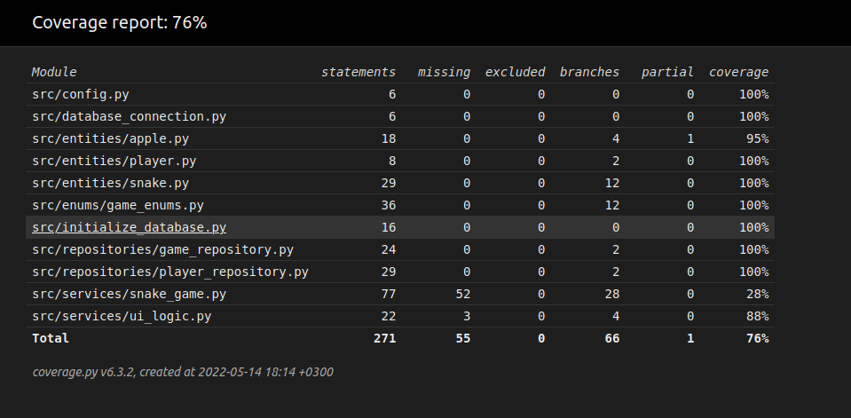

# Testausdokumentti

Ohjelmaa on testattu manuaalisesti kehityksen aikana, sekä automatisoiduilla yksikkö- ja integraatiotesteillä.

## Yksikkö- ja integraatiotestaus

### Sovelluslogiikka
Käyttöliittymälogiikan testaaminen perustuu pitkälti repositorio-luokkien testaamiseen.  
Pelilogiikan tapahtumia testataan `AppleTest` ja `SnakeTest` testeillä.

### Repositorio-luokat
Repositorio-luokkia `GameRepository` ja `PlayerRepository` testataan eri tiedostoilla kuin pelin aikana käytössä olevilla.  
Niiden tiedostosijainti on konfiguroitavissa `.env.test` tiedostossa.

### Testikattavuus
Käyttöliittymää lukuunottamatta sovelluksen testikattavuus on 76%.  

Testaamatta jäi `SnakeGame` ja `SnakeGameLoop`.

## Järjestelmätestaus
Sovelluksen järjestelmätestaus on suoritettu manuaalisesti.

### Asennus ja konfigurointi
Sovellus on haettu, ja sitä on testattu [käyttöohjeen](kayttoohje.md) mukaisesti Linux-ympäristössä.  
Testauksessa on myös koitettu muuttaa tietokannan nimeä `.env` tiedoston kautta.

### Toiminnallisuudet

[Vaatimusmäärittelyn](vaatimusmaarittely.md) toiminnallisuudet on testattu.

## Sovellukseen jääneet laatuongelmat

* `SnakeGame` ja `SnakeGameLoop` ei ole kunnon testejä
* Omena voi tulla käärmeen päälle luomisen yhteydessä
  * Vaatii kirjanpidon siitä, mitkä paikat ovat vapaana pelikentällä