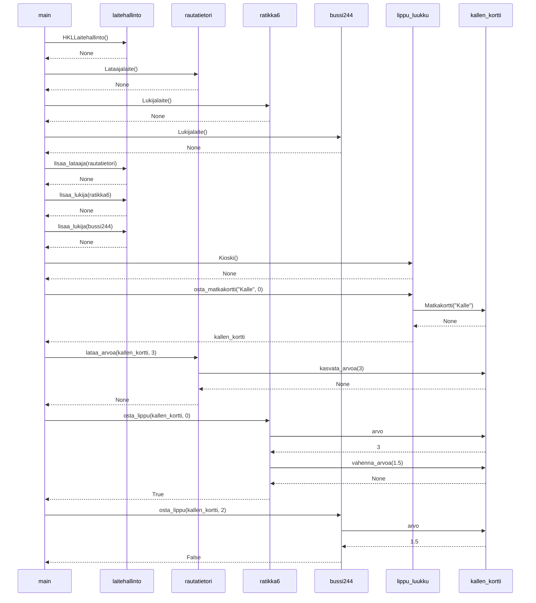

```mermaid
sequenceDiagram
	participant main
	participant laitehallinto
	participant rautatietori
	participant ratikka6
	participant bussi244
	participant lippu_luukku
	participant kallen_kortti
	main ->> laitehallinto: HKLLaitehallinto()
	laitehallinto -->> main: None
	main ->> rautatietori: Lataajalaite()
	rautatietori -->> main: None
	main ->> ratikka6: Lukijalaite()
	ratikka6 -->> main: None
	main ->> bussi244: Lukijalaite()
	bussi244 -->> main: None
	main ->> laitehallinto: lisaa_lataaja(rautatietori)
	laitehallinto -->> main: None
	main ->> laitehallinto: lisaa_lukija(ratikka6)
	laitehallinto -->> main: None
	main ->> laitehallinto: lisaa_lukija(bussi244)
	laitehallinto -->> main: None
	main ->> lippu_luukku: Kioski()
	lippu_luukku -->> main: None
	main ->> lippu_luukku: osta_matkakortti("Kalle", 0)
	lippu_luukku ->> kallen_kortti: Matkakortti("Kalle")
	kallen_kortti -->> lippu_luukku: None
	lippu_luukku -->> main: kallen_kortti
	main ->> rautatietori: lataa_arvoa(kallen_kortti, 3)
	rautatietori ->> kallen_kortti: kasvata_arvoa(3)
	kallen_kortti -->> rautatietori: None
	rautatietori -->> main: None
	main ->> ratikka6: osta_lippu(kallen_kortti, 0)
	ratikka6 ->> kallen_kortti: arvo
	kallen_kortti -->> ratikka6: 3
	ratikka6 ->> kallen_kortti: vahenna_arvoa(1.5)
	kallen_kortti -->> ratikka6: None
	ratikka6 -->> main: True
	main ->> bussi244: osta_lippu(kallen_kortti, 2)
	bussi244 ->> kallen_kortti: arvo
	kallen_kortti -->> bussi244: 1.5
	bussi244 -->> main: False
```