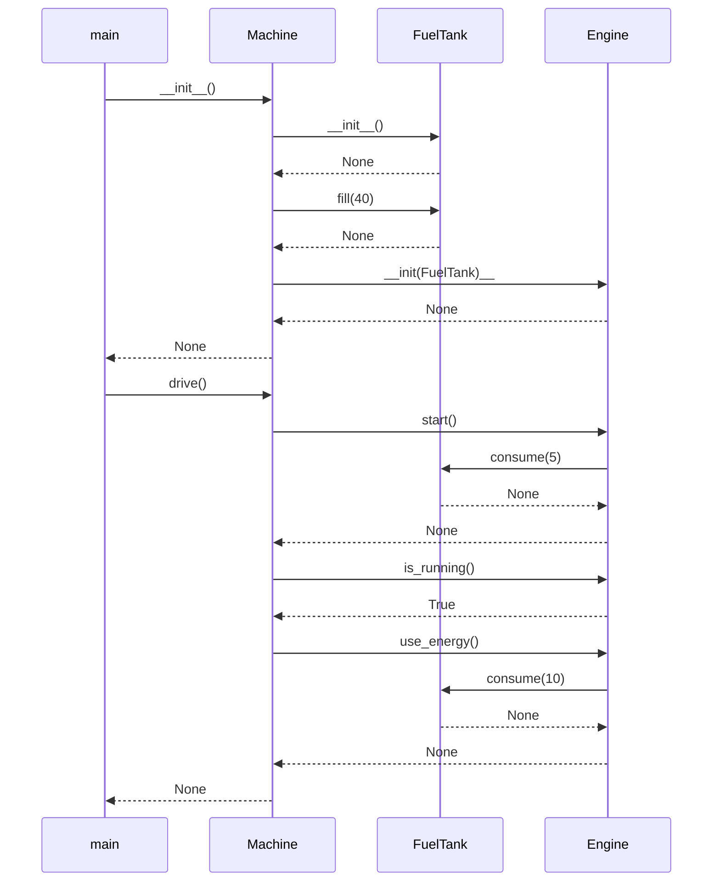

```mermaid
sequenceDiagram
	participant main
	participant Machine
	participant FuelTank
	participant Engine
	main ->> Machine: __init__()
	Machine ->> FuelTank: __init__()
	FuelTank -->> Machine: None
	Machine ->> FuelTank: fill(40)
	FuelTank -->> Machine: None
	Machine ->> Engine: __init(FuelTank)__
	Engine -->> Machine: None
	Machine -->> main: None
	main ->> Machine: drive()
	Machine ->> Engine: start()
	Engine ->> FuelTank: consume(5)
	FuelTank -->> Engine: None
	Engine -->> Machine: None
	Machine ->> Engine: is_running()
	Engine -->> Machine: True
	Machine ->> Engine: use_energy()
	Engine ->> FuelTank: consume(10)
	FuelTank -->> Engine: None
	Engine -->> Machine: None
	Machine -->> main: None
```