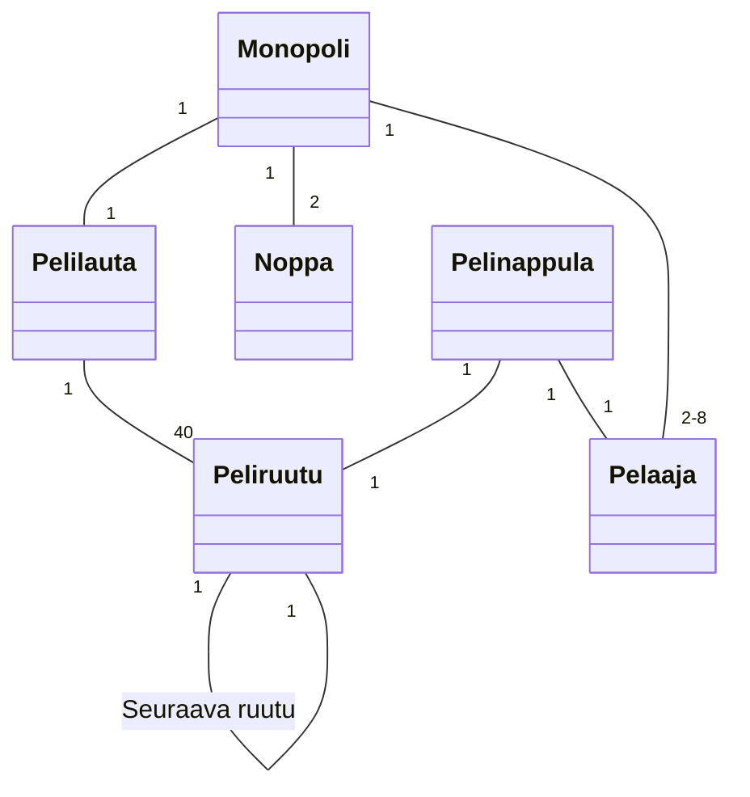
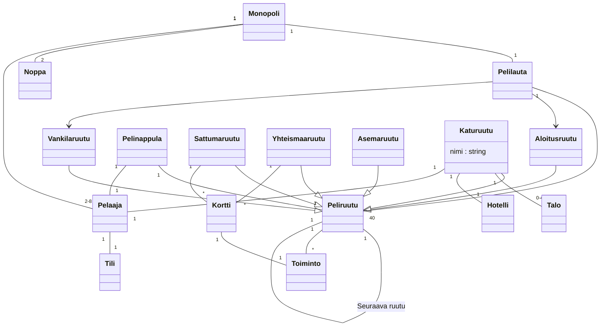

## Tehtävä 1: Monopoli

Monopolia pelataan käyttäen kahta noppaa. 
Pelaajia on vähintään 2 ja enintään 8. 
Peliä pelataan pelilaudalla joita on yksi. 
Pelilauta sisältää 40 ruutua. 
Kukin ruutu tietää, mikä on sitä seuraava ruutu pelilaudalla. 
Kullakin pelaajalla on yksi pelinappula. 
Pelinappula sijaitsee aina yhdessä ruudussa.

## Tehtävä 2: Laajennettu Monopoli

Monopolipelin täytyy tuntea sekä aloitusruudun että vankilan sijainti.
Jokaiseen ruutuun liittyy jokin toiminto.
Sattuma- ja yhteismaaruutuihin liittyy kortteja, joihin kuhunkin liittyy joku toiminto.
Toimintoja on useanlaisia. Ei ole vielä tarvetta tarkentaa toiminnon laatua.
Normaaleille kaduille voi rakentaa korkeintaan 4 taloa tai yhden hotellin. 
Kadun voi omistaa joku pelaajista. 
Pelaajilla on rahaa.

